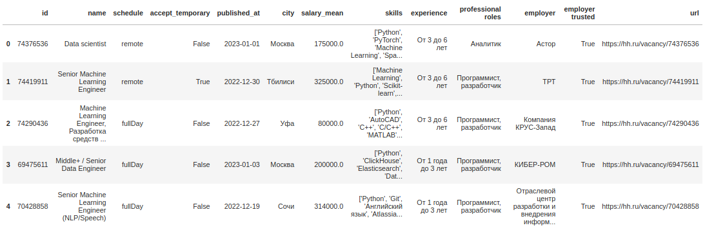
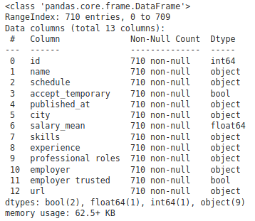
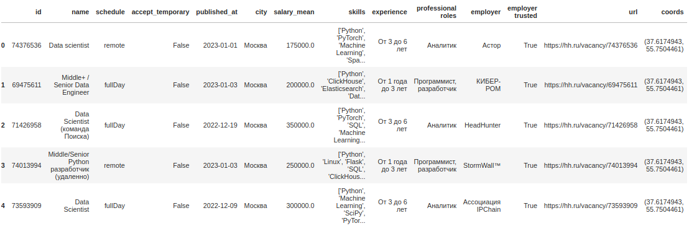
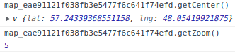
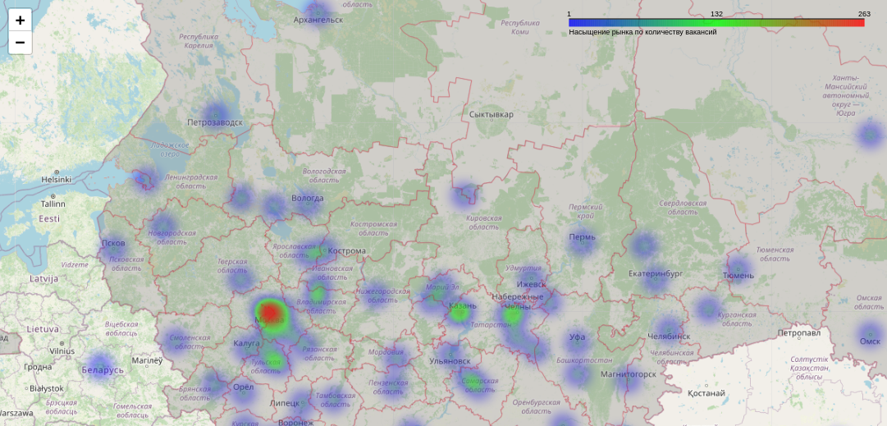
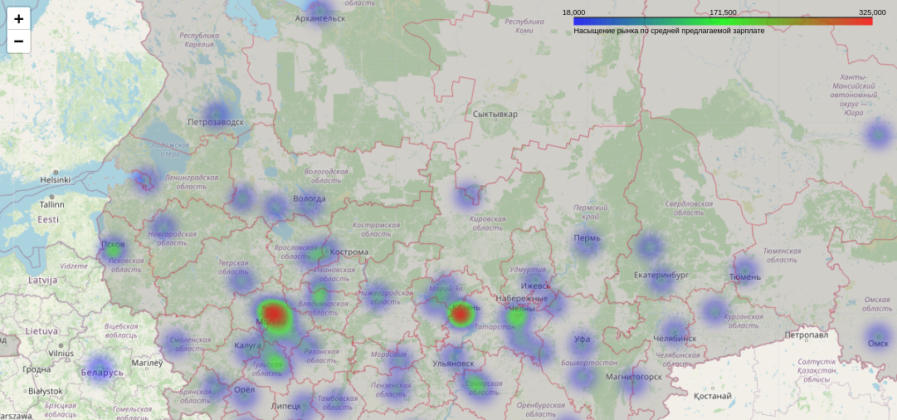

# Heatmap на интерактивной карте с помощью folium

Возникла необходимость изобразить на интерактивной карте актуальное предложение вакансий в сфере Data Science с агрегацией по городам.

Действовать будем в 3 этапа:

1. [Парсинг вакансий с hh API](#1-парсинг-вакансий-с-hh-api)
2. [Актуализация геолокаций каждой вакансии с точностью до населенного пункта](#2-актуализация-геолокаций-каждой-вакансии-с-точностью-до-населенного-пункта)
3. [Построение heatmap по количеству вакансий и по средней предлагаемой зарплате с помощью folium](#3-построение-heatmap-по-количеству-вакансий-и-по-средней-предлагаемой-зарплате-с-помощью-folium)

## 1. Парсинг вакансий с hh API

Воспользуемся официальным API hh.ru ([документация](https://github.com/hhru/api/blob/master/docs/general.md)).

Основные параметры, которые мы будем передавать через API:

|Параметр|Описание|
|:---:|:---:|
|'text'|Ключевое слово для поиска вакансий|
|'page'|Номер страницы в списке поиска вакансий|
|'per_page'|Количество вакансий на страницу (максимум 100)|
|'only_with_salary'|Только с указание зарплаты (работает некорректно, просачиваются вакансии без указания зарплаты)|

```python
def get_vacancies(skills, filename, pages=10):
    res = []
    for indx, skill in enumerate(skills):
        print(f'\ncollecting <{skill}> ({indx+1} of {len(skills)})')
        for page in range(pages):
            params = {
                'text': f'{skill}',
                'page': page,
                'per_page': 100,
                'only_with_salary': 'true',
            }
            req = requests.get('https://api.hh.ru/vacancies', params).json()
            if 'items' in req.keys():
                res.extend(req['items'])
            print('|', end='')

df = pd.DataFrame(res)
df.to_csv(filename, index=False)
```
Функция создает в текущей дериктории файл с указанным названием.
Полный листинг парсинга с очисткой данных [здесь](https://github.com/rufous86/hh_parcing/blob/main/parcing.py).

В нашем примере используем ключевые слова, характерные для выбранной сферы. Результат сохраним в файл 'data.csv'.

```python
skill_list = ['machine AND learning', 'data AND science', 'NLP',
              'spark', 'hadoop', 'pandas', 'dask', 'deep AND learning', 'pytorch',
              'tensorflow', 'keras', 'ai AND developer', 'computer AND vision',
              'нейронные AND сети', 'big AND data']

get_vacancies(skill_list, 'data.csv')
```
В результате получаем такую таблицу:





Нам понадобятся колонки 'city' и 'salary_mean'.

## 2. Актуализация геолокаций каждой вакансии с точностью до населенного пункта

Хотя некоторые вакансии на hh.ru снабжены геометками, актуальность их сомнительна (на поверку некоторые города оказываются совсем не в положенном им месте, часть даже оказалась посреди Черного моря).

Для актуализации координат населенных пунктов, указанных в вакансиях, воспользуемся библиотекой geopy ([документация](https://geopy.readthedocs.io/en/stable/)).

```python
from geopy.geocoders import Nominatim
geolocator = Nominatim(user_agent="geo")

def get_coords(city):
    geo = geolocator.geocode(city)
    if geo:
        return geo.longitude, geo.latitude
    else:
        return np.nan, np.nan


coords = pd.DataFrame(data=df['city'].unique(), columns=['city'])
coords['coords'] = (coords['city']
                        .apply(lambda x: get_coords(x)))

df = df.merge(coords, on='city')

df.head()
```


## 3. Построение heatmap по количеству вакансий и по средней предлагаемой зарплате с помощью folium

[Документация на folium](https://python-visualization.github.io/folium/)

```python
import folium
from folium import plugins, branca
```

Для начала создаем объект класса Map для рисования карты. В него передаем для параметра: координаты локализации и степень приближения при загрузке карты.

```python
mapObj = folium.Map(location=[57.23337810789467, 48.05744173358704], zoom_start=5)
```

> <u>Лайфхак</u>. Для определения координат и степени приближения можно сделать так:

> Создаем объект класса Map с параметрами по-умолчанию, сохраняем в формат html.
```python
mapObj = folium.Map()
mapObj.save('output.html')
```
> Открываем сохраненный файл 'output.html'. Перемещаемся в интересующее место на карте. Правая кнопка -> inspect -> Console. Вводим:

> map_<какие-то буквы, цифры>.getCenter() - получаем координаты центра текущего вида.

> map_<какие-то буквы, цифры>.getZoom() - получаем zoom текущего вида.



Мне было необходимо очертить границы регионов на карте. Для этого добавляем в нашу карту информацию из [файла](https://github.com/rufous86/hh_parcing/blob/main/russia.geojson) формата geojson. В параметр 'style_function' передаем словарь с характеристиками стиля изображения данных нашего geojson (цвет линий, их толщина, цвет заливки, прозрачность).
```python
bordersStyle = {
    'color': 'red',
    'weight': 0.2,
    'fillColor': 'grey',
    'fillOpacity': 0.3
}

folium.GeoJson('russia.geojson',
               name='Russia',
              style_function=lambda x: bordersStyle).add_to(mapObj)
```

Создаем список координат и передаем его в класс HeatMap. Дабавляем HeatMap к нашему объекту карты.
```python
heat_data = [[lat, lon] for lon, lat in df['coords']]
plugins.HeatMap(heat_data, radius=18, gradient={0.4: 'blue', 0.65: 'lime', 1: 'red'}).add_to(mapObj)
```
Легенду можно создать с помощью класса LinearColormap:
```python
colormap = branca.colormap.LinearColormap(['blue', 'lime', 'red'], 
                                          vmin=1, 
                                          vmax=df['city'].value_counts()[0], 
                                          caption='Насыщение рынка по количеству вакансий')
colormap.add_to(mapObj)
```


Теперь карту можно сохранить в формат 'html'.
```python
mapObj.save('output1.html')
```


Тоже самое проделаем для данных о средней зарплате. Единственное отличие - в список heat_data помимо координат передаем третий параметр weight (им будут вычисленные в разрезе населенных пунктов средние зарплаты)

```python
salary_mean = (df
     .groupby('city')[['salary_mean']]
     .agg('mean')
)

salary_mean = coords.merge(salary_mean, on='city')

mapObj = folium.Map(location=[57.23337810789467, 48.05744173358704], zoom_start=5)

bordersStyle = {
    'color': 'red',
    'weight': 0.2,
    'fillColor': 'grey',
    'fillOpacity': 0.3
}

folium.GeoJson('russia.geojson',
               name='Russia',
              style_function=lambda x: bordersStyle).add_to(mapObj)

heat_data = []
for i in range(len(salary_mean)):
    heat_data.append([*reversed(salary_mean['coords'][i]), salary_mean['salary_mean'][i]])

plugins.HeatMap(heat_data, radius=18, gradient={0.4: 'blue', 0.65: 'lime', 1: 'red'}).add_to(mapObj)

colormap = branca.colormap.LinearColormap(['blue', 'lime', 'red'], 
                                          vmin=salary_mean['salary_mean'].min(), 
                                          vmax=salary_mean['salary_mean'].max(), 
                                          caption='Насыщение рынка по средней предлагаемой зарплате')
colormap.add_to(mapObj)

mapObj.save('output2.html')
```



Полный листинг примера в [репозитории Github](https://github.com/rufous86/hh_parcing)